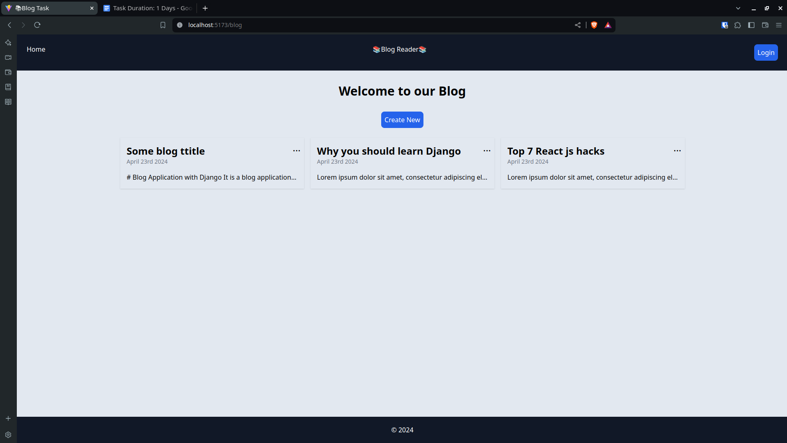
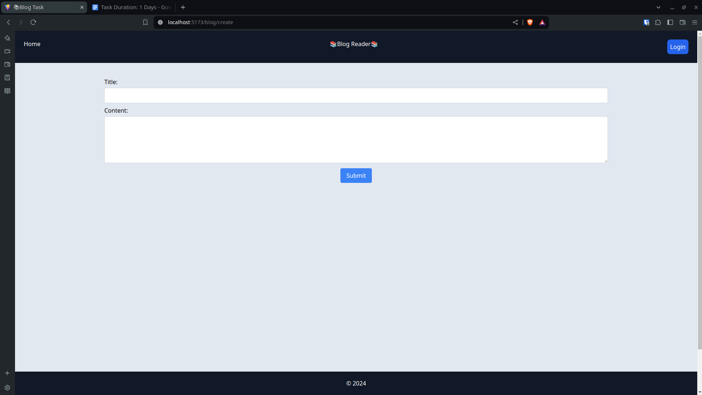
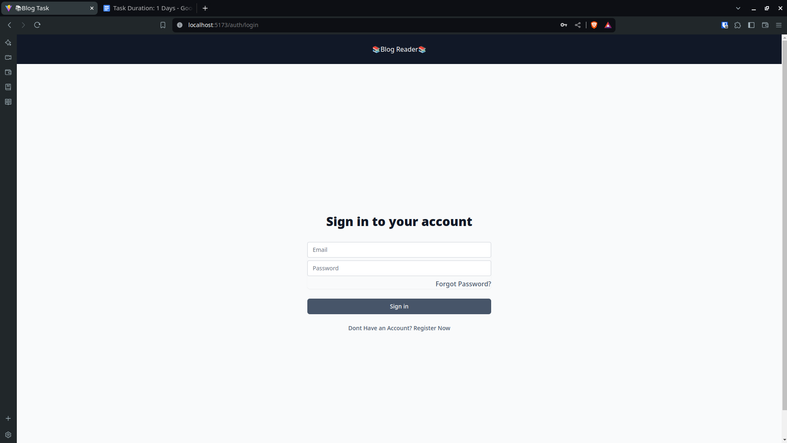
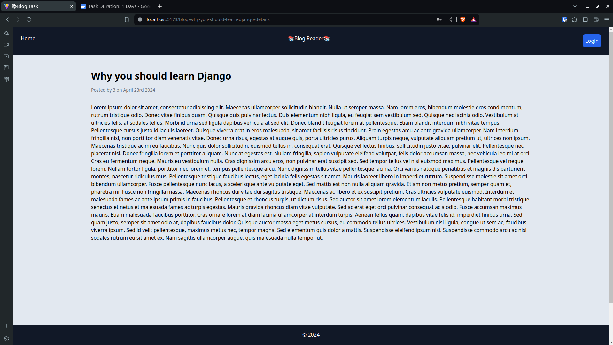

# Blog Application with Django

It is a blog application made by using django, react and postgreSQL stack. Some features of the app are:

- Test first approach.
- Tests for CustomUser account and blog views.
- JWT authentication with email as username.
- Authorization: Only users who created the blog can modify/delete it.
- Every user can view all blogs.
- CRUD operations on blog.
- Slug based url for SEO optimization.
- React UI with tailwindCSS for optimized performance.
- Mobile responsive.

### Project Gallery

<table>
<tr>
    <th>
    </th>
    <th>

    </th>
</tr>

<tr>
    <th>
    </th>
    <th>

    </th>
</tr>
</table>

## Steps involved in setting up the project

1. Clone project locally.
2. Setup database(postgreSQL).
3. Setup backend(Django backend).
4. Setup Frontend(React App)

<a href="https://documenter.getpostman.com/view/28093502/2sA3Bq4Avt" target="_blank">API Documentation</a>

### Clone project locally

1. `$ git clone <link-to-this-repository>`

### Setting up Database

Below are steps to setup databse using shell. You can perform similar actions using GUI tools by noting down the credentials below.

1. Open postgres shell:  
   `$ sudo su - postgres`
2. Login to your default postgres account:  

   `# psql -U postgres -W`  
   (If you wish to create new user account, you'll need to provide privileges of database to this user and supply these credentials in the `settings.py` file.)

3. Create database:  
   `CREATE DATABASE blog;`
4. Exit psql shell:  
   `\q`

### Setting up Backend Server

1. Navigate to the backend folder.
2. Create a virtual environment.  
   `$ python -m venv .venv`
3. Activate virtual environment.  
   On Linux/Mac: `$ source .venv/bin/activate`
4. Install required dependencies.  
   `$ pip install -r requirements.txt`
5. Run migrations to your database.  
   `$ python manage.py migrate`
6. Run tests (Optional).   
   `$ python manage.py test`
7. Run server.  
   `$ python manage.py runserver`

### Setting up Frontend Server

1. Navigate to frontend/ folder.
2. Install dependencies.  
   `$ npm i`
3. Run server.  
   `$ npm run dev`
